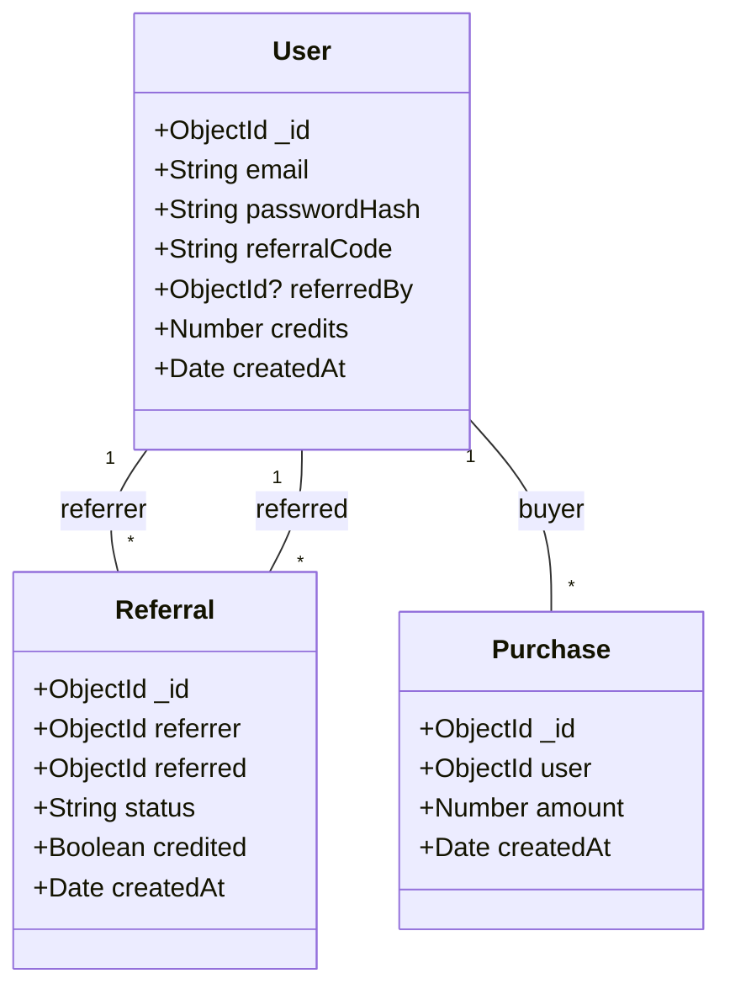
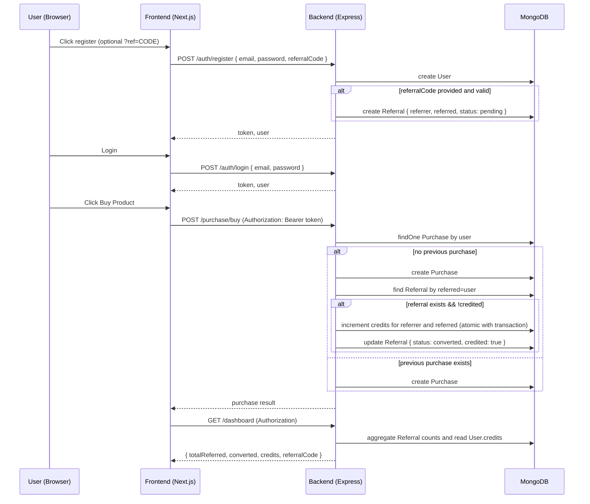

# System Design — Referral & Credit System

This document explains the architecture, data models, and data flows for the Referral & Credit System (FileSure assignment). It includes diagrams and notes about data integrity and deployment.

**Repository layout (relevant)**

- `backend/` — Express + TypeScript REST API with Mongoose models
- `frontend/` — Next.js + TypeScript + Tailwind frontend
- `docs/` — architecture and UML diagrams

**High-level Architecture**

- Client (Browser) — Next.js frontend
- API Server — Express + TypeScript (REST)
- Database — MongoDB (Mongoose)

The following SVG UML diagram shows the components and the main data-flow arrows: `docs/uml.svg` (also rendered below in supported viewers).

---

## Data Models

Class diagram (Mermaid):

### Important Schema Constraints

- `User.email` is unique and indexed.
- `User.referralCode` is unique and indexed.
- `Referral` stores `credited: boolean` to prevent double-crediting.
- `Purchase` records purchases per user; the system checks whether a user has any prior purchases to determine "first purchase".

## API Overview

- `POST /api/auth/register` — register new user. Optional body field `referralCode` to link the new user to an existing referrer.
- `POST /api/auth/login` — authenticate and return JWT.
- `POST /api/purchase/buy` — authenticated endpoint to simulate a purchase. If it's the user's first purchase and they were referred, credit both users and mark referral converted.
- `GET /api/dashboard` — authenticated endpoint returning `{ totalReferred, converted, credits, referralCode }`.

## Sequence Flows

Sequence diagram (Mermaid):

## Data Integrity & Concurrency

- Prevent double-crediting by marking `Referral.credited = true` once credits are applied.
- Use MongoDB sessions/transactions when available (replica set or Atlas) to perform multiple updates atomically:
  - create Purchase
  - update `User.credits` for both users
  - update `Referral` record to `credited=true`
- If transactions aren't available (standalone MongoDB), operations are performed with best-effort order and `credited` flag prevents multiple credits. Additional application-level idempotency checks can be added.

## Indexes & Performance

- Index `User.email` and `User.referralCode` (unique).
- Index `Referral.referrer` and `Referral.referred` for quick lookups.
- Index `Purchase.user` to efficiently determine whether a user has previous purchases.

## Security

- Passwords are stored as hashes (bcrypt).
- JWT secret stored in environment variable (`JWT_SECRET`).
- Validate and sanitize user input on both frontend and backend.

## Deployment Notes

- Frontend: Deploy to Vercel (recommended) — set `NEXT_PUBLIC_API_BASE` to backend URL.
- Backend: Deploy to Render / Railway / Heroku / Docker container. If using MongoDB transactions, use MongoDB Atlas or a replica set.

## Files added

- `docs/uml.svg` — an SVG diagram that visually describes components and data flow.
- `docs/architecture.md` — this document.

---

If you want, I can also generate a PNG export of the SVG, or produce a higher-fidelity diagram (draw.io, Lucidchart) and include it in the repo. Tell me which format you prefer.
